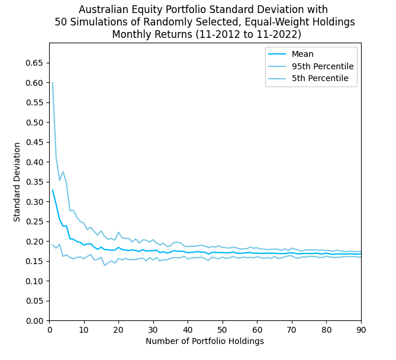
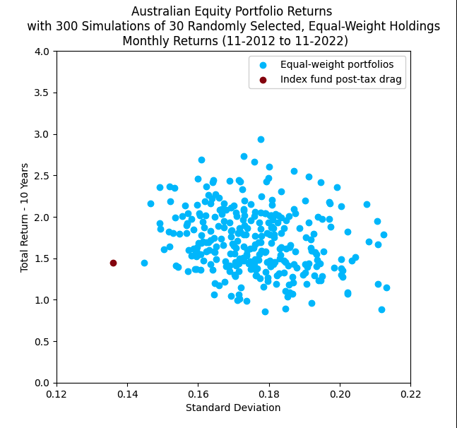

## IKEA-Portfolio-Management

**Explanation**

Answering the question, how would a retail investor perform who invested in a randomly selected, equally-weighted portfolio of companies and held the portfolio without rebalancing? 
Compared to investing through a retail fund, the strategy benefits from avoiding CG tax drag and management fees.

**portfolio_sd.py**

Retail investors are limited in the number of individual securities they
can directly hold because as the number of portfolio holdings 
increases, so does the cost of brokerage as a proportion of their total 
investment. One of the benefits of investing through a fund is that it makes holding
 hundreds or even thousands of securities relatively inexpensive. Studies have shown, however, that investors gain most of the diversification benefit with a relatively small number of holdings. 

**portfolio_returns.py**

Investing through a retail fund comes with significant cost that 
potentially outweigh the benefits of increased diversification and 
convenience. Looking at historic fund statements, I calculate the annual average realised capital gains tax as a percent of investment value to be ~1.21%. Conservatively, assuming that all the capital gains distributed to fund holders are eligible for the 12 month holding period discount and a marginal tax rate of 32.5%, fund holders are subject to 20 bps of tax drag each year. Management fees subtract an additional 7 to 13 bps. 

