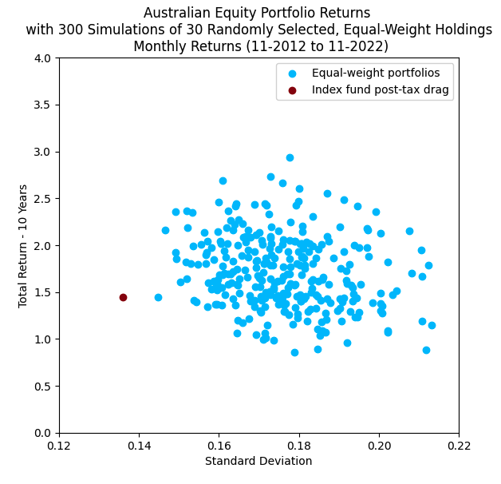

## IKEA-Portfolio-Management

**Explanation**

Long investment horizon -> harvest equity risk premium while avoiding fee and tax drag -> Small, equal-weight portfolio

Answering the question: compared to an index fund ETF, how would a retail investor perform who invested in a randomly selected, equal-weight portfolio of Australian companies and held the portfolio without rebalancing? Compared to investing through an index fund, which sells its holdings to rebalance to the index weights, the strategy benefits from avoiding capital gains tax until the end of the investment period. In addition, there are no management fees paid on the portfolio. 

I generated the results using Python with data sets web scraped from Yahoo Finance (security prices) and Trading Economics (market capitalisations). I used the market capitalisations to restrict the investable universe to securities larger than 700m at the beginning of the analysed period. This filtering reduces backfill bias in the Yahoo Finance dataset and the tendency for equal-weight portfolios to tilt toward the size risk factor.

**Results from portfolio_sd.py**

Retail investors are limited in the number of individual securities they can directly hold because as portfolio holdings increase, so does the cost of brokerage as a proportion of their total investment. One of the benefits of investing through a fund is that it makes holding hundreds or even thousands of securities relatively inexpensive. However, investors gain most of the diversification benefit with a relatively small portfolio, as demonstrated below. 

I calculated the standard deviations for fifty random samples of each number of holdings in the portfolio. Increasing the portfolio size from one to thirty holdings markedly reduces standard deviation, but adding additional holdings thereafter only slightly reduces risk. 

**Results from portfolio_returns.py**

I next evaluated the 10 year return for 300 simulations of an equal-weight portfolio.  Given the results of the previous analysis, I used a portfolio size of thirty for each portfolio as it captures most of the diversification benefit and is a manageable size for a retail investor. 

For a comparison portfolio, I chose an Australian equities index fund. Looking at historic fund statements, I calculate the average annual realised capital gains tax as a percent of investment value to be ~1.21%. Assuming that all the capital gains distributed to fund holders are eligible for the 12-month holding period discount and a marginal tax rate of 32.5%, fund holders are subject to 20 bps of tax drag each year. I, therefore, subtracted 1.67 bp from each monthly return of the comparison portfolio. 

In the results pictured, 73% of the portfolios outperformed the Australian index fund but with significant active risk. 

